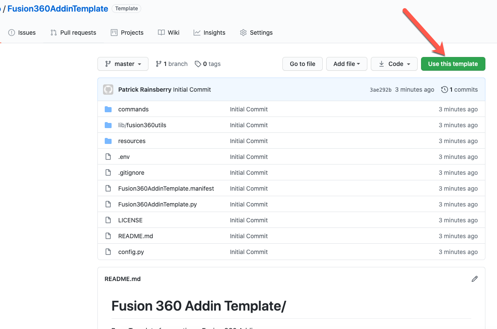
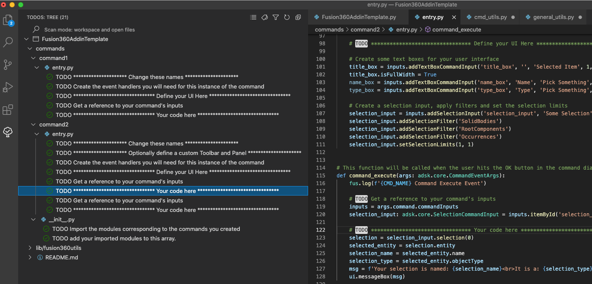

# Fusion 360 Addin Template
Base Template for creating a Fusion 360 Addin

[How to use](#how-to-use)

[For Developers](#for-developers)

----

## How to use 
The template layout defines the necessary behaviors for commands in a Fusion 360 add-in.

The general structure defined here places each unique command in its own sub-directory within */commands*.

To use this template you need to modify the behaviors defined in the *entry.py* for each command.

To create additional commands you can simply:
1. Duplicate one of the existing command directories.
2. Edit /commands/__init__.py to include your new command in the **commands** array

The following is a more detailed step-by-step guide.

### Create your new Add-in
1. Click the button labeled "Use this template"
2. Clone your new add-in to the add-ins folder on your local machine
3. TODO show location reference

### To Rename your new Add-in
1. TODO - something about the GitHub repo... 
2. Rename the directory
3. Rename *Fusion360AddinTemplate.py*
4. Rename *Fusion360AddinTemplate.manifest*

**IMPORTANT: All three of the items above must have the same name for Fusion 360 to recognize the addin**

### Modify the predefined template commands
TODO better descriptions and snippets

* You can modify the functions defined in the *entry.py* file for the default commands
* Edit the command_created function to define your UI and what other events you will include for the command
* Edit the command_executed, or other functions, to modify the behavior of your command

#### Command Summary: 
* *command1* - Simple command with text and value inputs.  Added to the Create Panel on the Solid Tab
* *command2* - Simple command with a selection input.  Creates a new Tab and Panel. 
* *paletteShow* - Creates a Palette and displays its HTML content
* *paletteSend* - Sends a custom message to the Palette's Javascript

### Use the TODO Comments
The template files are marked with comments containing the **TODO** tag everywhere you can/should edit the code.

You can use one of the many TODO extension from the VS Code Marketplace to navigate these items.

For example using the [TODO Tree](https://marketplace.visualstudio.com/items?itemName=Gruntfuggly.todo-tree) extension:

Once installed you can see a tree view of all the TODO items and quickly navigate to the relevant sections:

### Create additional commands
TODO better descriptions and snippets

* You can duplicate the directory of command1 or command2 to create additional commands for your add-in
* **Important**After duplicating the directory you must edit /commands/__init__.py to add the new command

### Running the Add-in
1. Launch Fusion 360.   
2. On the main toolbar click the **Scripts and Addins** button in the **Addins** Pane

	
     
3. Select Fusion360AddinTemplate run.

## For Developers
TODO some info about submitting PR's
Fork, PR, etc...
   
## License
Copyright 2020 Autodesk

Permission is hereby granted, free of charge, to any person obtaining a copy of this software and associated documentation files (the "Software"), to deal in the Software without restriction, including without limitation the rights to use, copy, modify, merge, publish, distribute, sublicense, and/or sell copies of the Software, and to permit persons to whom the Software is furnished to do so, subject to the following conditions:

The above copyright notice and this permission notice shall be included in all copies or substantial portions of the Software.

THE SOFTWARE IS PROVIDED "AS IS", WITHOUT WARRANTY OF ANY KIND, EXPRESS OR IMPLIED, INCLUDING BUT NOT LIMITED TO THE WARRANTIES OF MERCHANTABILITY, FITNESS FOR A PARTICULAR PURPOSE AND NON-INFRINGEMENT. IN NO EVENT SHALL THE AUTHORS OR COPYRIGHT HOLDERS BE LIABLE FOR ANY CLAIM, DAMAGES OR OTHER LIABILITY, WHETHER IN AN ACTION OF CONTRACT, TORT OR OTHERWISE, ARISING FROM, OUT OF OR IN CONNECTION WITH THE SOFTWARE OR THE USE OR OTHER DEALINGS IN THE SOFTWARE.

## Author
Written by Patrick Rainsberry

See more useful [Fusion 360 Samples](https://github.com/AutodeskFusion360)

## Some notes and considerations
* Even in the case of the template repo on GitHub we need to account for regenerating the app id guid

