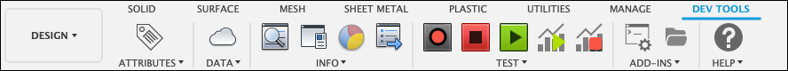

# Fusion360DevTools
A collection of utilities to assist in developing Fusion 360 Add-ins

# Installation
Follow the [installation instructions here](https://tapnair.github.io/installation.html) for your particular OS version of Fusion 360

# Usage

Everything lives in a **Fusion360DevTools** tab in the Design workspace, split into panels.

## ATTRIBUTES

Attributes are invisible, so these make them visible while you are developing with them.

| Command | What it does |
| --- | --- |
| Attributes - All | Lists every attribute in the active document |
| Attributes - Selected | Lists the attributes on the current selection |
| Attributes - Add | Adds an attribute by hand, for setting up a test case |

## DATA

| Command | What it does |
| --- | --- |
| Data Info | Hub, project, folder, lineage and version URNs for the active document, plus the base64 forms and a Fusion Team link |
| Close All | Closes every open document **without saving** |

## INFO

| Command | What it does |
| --- | --- |
| API Object Explorer | Walks the API object model for whatever you select, following properties as you click them |
| User Interface Explorer | The tree of workspace, tab, panel and control ids, which is how you find the id to attach your own command to |
| Appearance Explorer | Every appearance and material applied in the document, and lets you remove them |
| Command Stream | Streams the id and name of each command as it runs, and the current selection, so you can see what Fusion is actually calling |

## TEST

| Command | What it does |
| --- | --- |
| Start Performance Capture | Starts a `cProfile` capture |
| Stop Performance Capture | Ends the capture and opens the results palette |
| Record Test / Run Test / Stop Recording | Records a command and its inputs, then replays it and compares the resulting geometry. Very experimental, so it is off by default — set `ENABLE_RECORD_COMMANDS = True` in `config.py` to show these |

## ADD-INS

Shortcuts to the Scripts and Add-Ins dialog, the App Store, and your local `AddIns` folder.

## HELP

Links to the online API documentation, the offline CHM download, and the Fusion 360 GitHub samples.

# Performance Capture

1. **Start Performance Capture** begins profiling. It confirms in the TEXT COMMANDS palette,
   since there is no dialog to show.
2. Use the commands you want to measure.
3. **Stop Performance Capture** snapshots the capture and opens the results palette.

The palette has four views over the same capture, all driven by the filters above them:

- **Hot spots** — the pstats table, sortable by any column, with a share bar on every row.
  Select a row to see what called it and what it called; those lists are clickable, so you
  can walk the call graph, and a breadcrumb trail tracks where you have been.
- **Call tree** — the call graph walked out into a tree, each branch's time scaled to the
  path it sits on. cProfile records a call graph rather than call stacks, so a function
  reached from several callers appears under each of them and branch times are an
  approximation; recursion stops at the repeated call.
- **Modules** — one row per file, expandable to the functions inside it.
- **Compare** — two captures side by side, to see whether a change actually helped.

Every function is tagged with the kind of code it is — your code, Fusion API, adsk wrappers,
Python, imports, or Dev Tools itself. That is what the bar at the top breaks down, and what
the *Hide imports* and *Hide Python internals* filters use to get the noise out of the way.

A capture can be saved as `.prof` (which [snakeviz](https://jiffyclub.github.io/snakeviz/)
and [tuna](https://github.com/nschloe/tuna) read), `.csv` or `.json`, or written to the TEXT
COMMANDS palette as the classic pstats table. **Open source** on a selected function opens
that line in VS Code or PyCharm. The palette follows Fusion's light or dark theme and has a
toggle to override it.

Captures are kept for the session, so the Capture dropdown and the Compare view can reach
back through the last several of them. They are not written to disk unless you export them.

### Working on the palette itself

The palette is plain HTML, CSS and JavaScript in `commands/performance/resources/html`, and
the page can be opened outside Fusion: export a capture as `.json`, save it as
`static/fixture.json`, serve that folder over http (`python3 -m http.server`) and open
`index.html`. With no Fusion bridge present the page falls back to that fixture, so the
styling can be worked on without restarting the add-in. `fixture*.json` is git ignored.

Note that a browser preview does not exercise the Fusion bridge. Inside a palette the `adsk`
object is injected some time *after* the page loads, which is why `performance.js` waits for
it before its first request.

# Notes

Fusion now runs Python 3.14. Two things worth knowing if you are writing against these tools:

- Since Python 3.12, `cProfile` registers with `sys.monitoring` instead of `sys.setprofile`.
  Only one profiler can be active per interpreter, and the slot is not released by garbage
  collection, so `commands/performance/profile_utils.py` reclaims an abandoned one rather
  than leaving profiling broken for the rest of the session.
- The API's generated type annotations now read `adsk.fusion.Foo` rather than
  `adsk::fusion::Foo`. `objectType` and `classType()` still use the `::` form.

## License
Samples are licensed under the terms of the [MIT License](http://opensource.org/licenses/MIT). Please see the [LICENSE](LICENSE) file for full details.

## Written by

Written by [Patrick Rainsberry](https://www.linkedin.com/in/patrickrainsberry/)  

See more useful [Fusion 360 Utilities](https://autodeskfusion360.github.io/)

