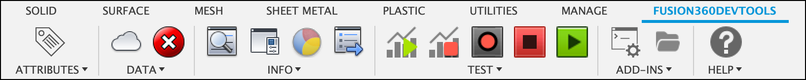

# Fusion360DevTools
A collection of utilities to assist in developing Fusion 360 Add-ins

# Usage
More documentation to come

# Installation
Follow the [installation instructions here](https://tapnair.github.io/installation.html) for your particular OS version of Fusion 360

## License
Samples are licensed under the terms of the [MIT License](http://opensource.org/licenses/MIT). Please see the [LICENSE](LICENSE) file for full details.

## Written by

Written by [Patrick Rainsberry](https://www.linkedin.com/in/patrickrainsberry/)  

See more useful [Fusion 360 Utilities](https://autodeskfusion360.github.io/)

